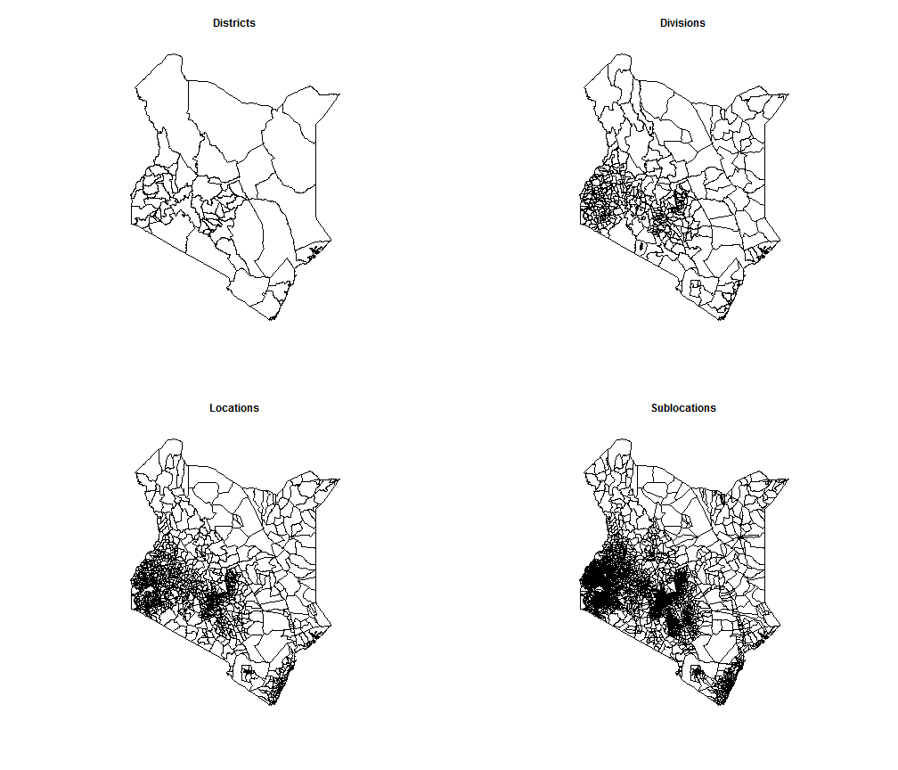
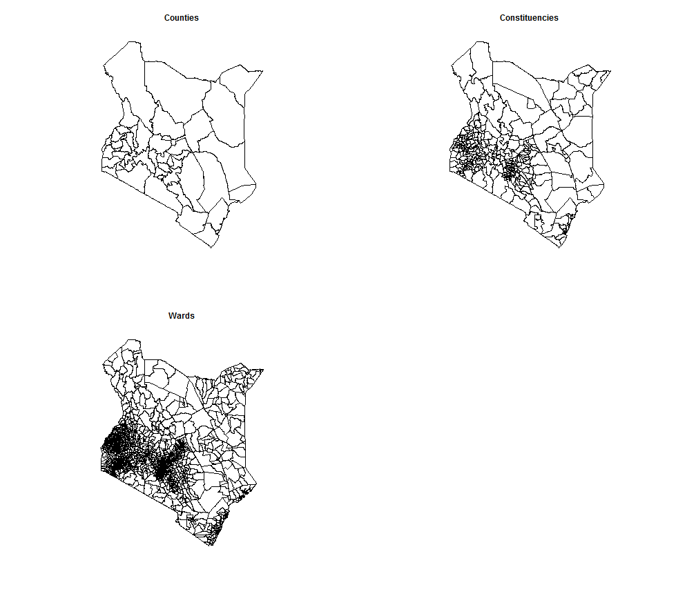
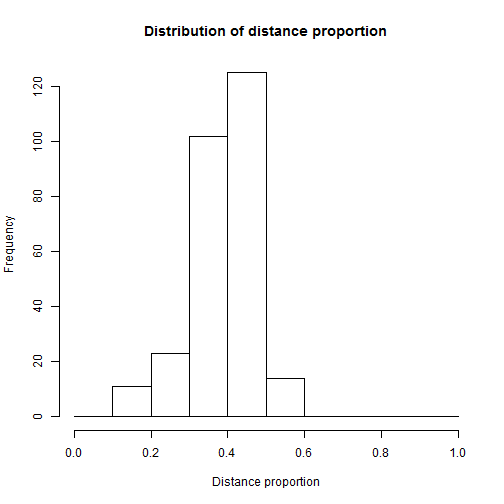
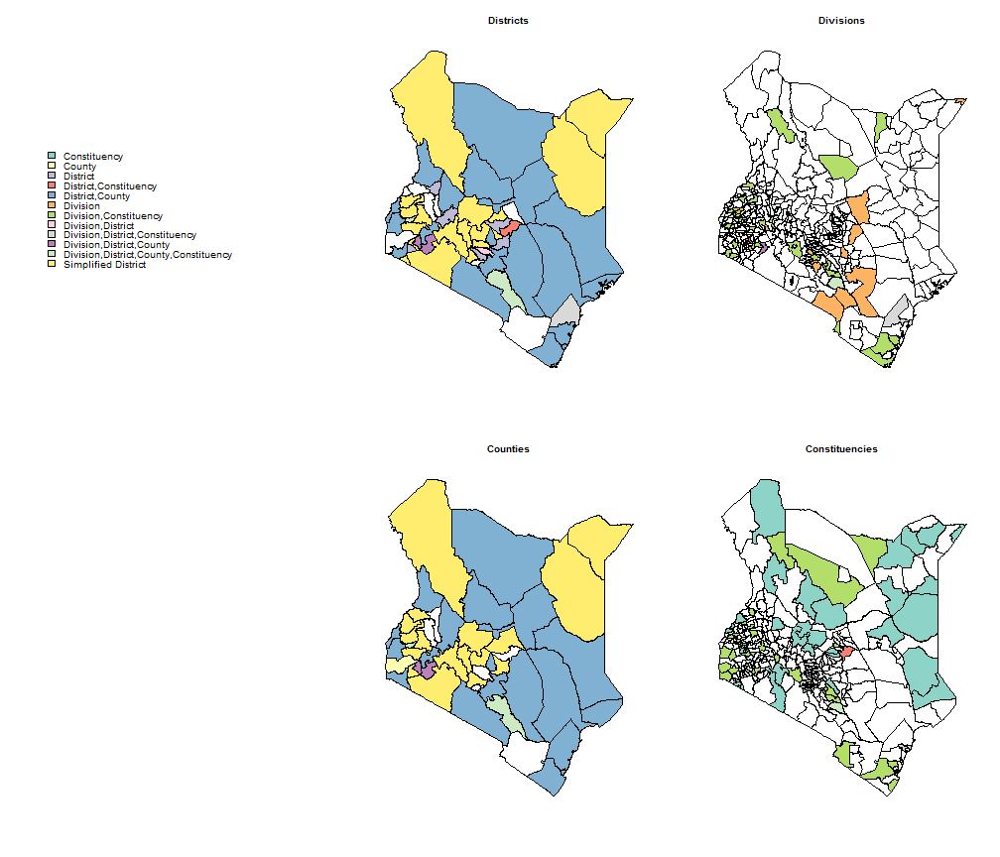
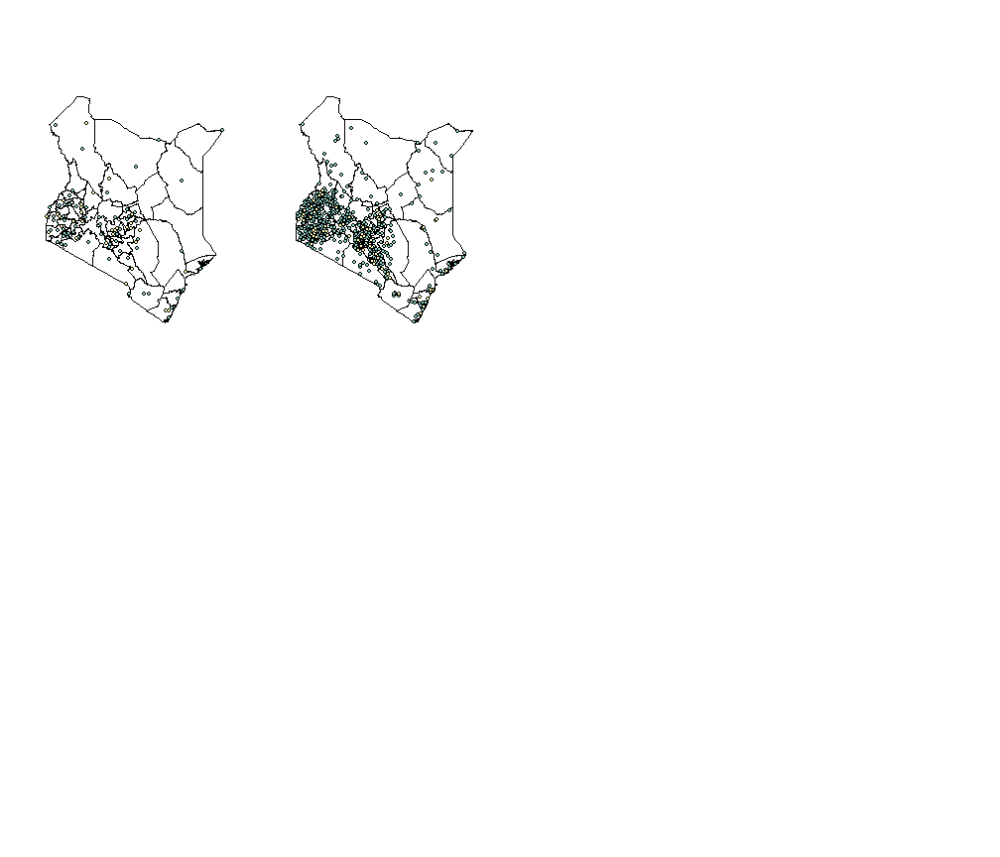
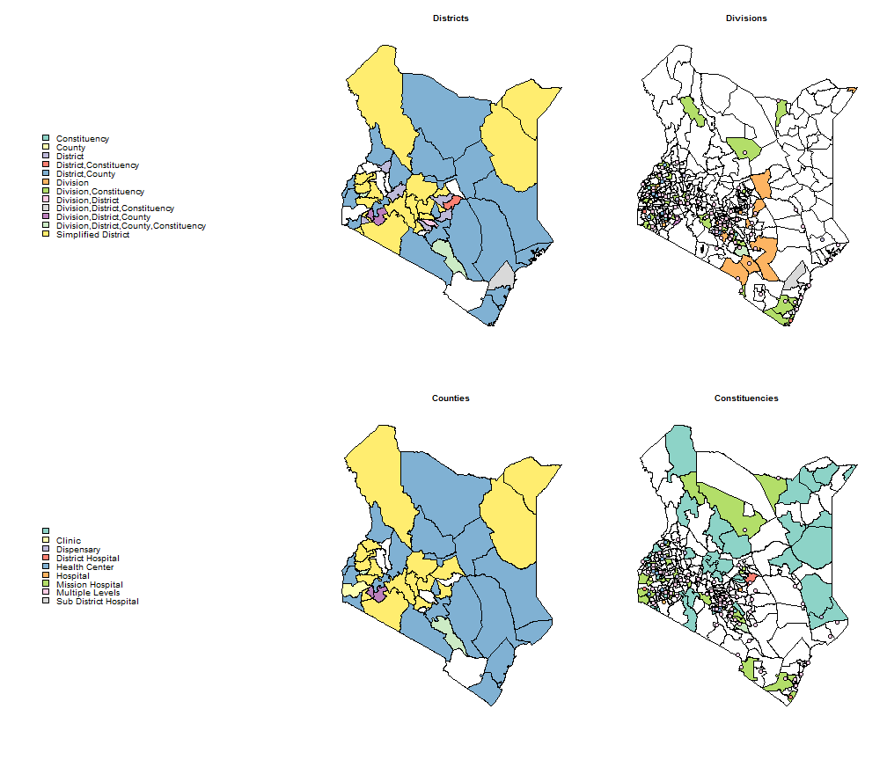

Kenya HMIS Map Building
========================================================

Goal
--------------------------------------------

Data from the Kenyan HMIS is supposedly structured by Districts. Yet The exact map is not clear, as some names are not official districts names. It seems there is a mix in the denomination of the districts between :
* Names from the administrative organisation
* Names from the political organisation
* Names from different levels of each of these organisations

In order to use the data, we would like to assign each District in our dataset to a given Kenyan spatial unit.

Our objective here is to :
1. Map each district in our dataset to a given spatial unit
2. Take out districts for which no clear spatial unit is fund
3. Evaluate spatial coverage of the data available

The analysis needs the following libraries in R

```r
library(maptools)
library(sqlshare)
library(stringr)
library(plyr)
library(RColorBrewer)
palette(value = brewer.pal(12, "Set3"))
```


Kenyan geographic organisation
-------------------------------------------------------

The geographic organisation has been modified by the 2010 national constitution. The data we have goes from 2008 to 2011, and we use shapefiles and references older than 2010.

### Administrative

[Wikipedia page on Divisions](http://en.wikipedia.org/wiki/Divisions_of_Kenya)

The descending levels are
* District
* Division
* Location
* Sublocation


With available maps :

```r
Districts <- readShapePoly("Shapefiles/Districts//kenya_districts98.shp")
Divisions <- readShapePoly("Shapefiles/Divisions/kenya_divisions2000.shp")
Locations <- readShapePoly("Shapefiles/Locations/kenya_locations.shp")
subLocations <- readShapePoly("Shapefiles/Sublocations//kenya_sublocations.shp")

par(mfrow = c(2, 2))
plot(Districts)
title(main = "Districts")
plot(Divisions)
title(main = "Divisions")
plot(Locations)
title(main = "Locations")
plot(subLocations)
title(main = "Sublocations")
```

 


In the current shapefiles, we have 58 districts , 
390 divisions, 1066 locations and 3447 sublocations.

### Political

[Wikipedia page on Constituencies](http://en.wikipedia.org/wiki/Constituencies_of_Kenya)

The descending levels are 

* Counties
* Constituencies
* Wards


```r
Counties <- readShapePoly("Shapefiles/Counties/counties.shp")
Constituencies <- readShapePoly("Shapefiles/Constituencies/constituencies.shp")
Wards <- readShapePoly("Shapefiles/Wards/ward.results.formatted.shp")

par(mfrow = c(2, 2))
plot(Counties)
title(main = "Counties")
plot(Constituencies)
title(main = "Constituencies")
plot(Wards)
title(main = "Wards")
```

 


In the current shapefiles, we have 48 counties, 291 constituencies and 1399 wards.

Districts in our Data
----------------------------------------------

We get a list of units in our data from the 705A reports.


```r
Data705A <- fetch.data.frame("select * from [grlurton@washington.edu].[Rep705ATotal]")
DataDistricts <- as.character(unique(Data705A$District))
```


We have 176 in our data. This suggests that the data is probably a mix of level 1 and 2 units. At the time of analysis, no evidence nor qualitative element is available as of how this blend could have been made.

Working hypothesis
----------------------------------------------------
For now we will make the following hypothesis
* All the districts are exclusive of each other. This is reasonable as the data comes from an administrative system in which data collection is probably hierarchized (lower level datasets would be included in the folder of their parent unit, and not alongside).
* All districts represent only one geographic partition of the kenyan territory. This is also reasonable as the time series of the data we have suggest we have the same years of data for all district.

### Steps to take
As a start will limit ourselves to work in the two first levels of each hierarchy.

1. First matching of the names in the data to any name in any level of any hierarchy. For names of form 'south xx' try substitutions
2. Approximate string matching
3. Identify unequivocal districts

Step 1 : matching of all possible combinaisons
----------------------------------------------------

We first standardize the names in the shapefiles and in the Districts


```r
formatNames <- function(x) {
    tolower(str_trim(as.character(x)))
}

Districts$DISTRICT <- formatNames(Districts$DISTRICT)
Divisions$DIVISION <- formatNames(Divisions$DIVISION)
Counties$COUNTY_NAM <- formatNames(Counties$COUNTY_NAM)
Constituencies$CONSTITUEN <- formatNames(Constituencies$CONSTITUEN)

ShapefileNames <- data.frame(NameOrig = c(unique(as.character(Divisions$DIVISION)), 
    unique(as.character(Districts$DISTRICT)), unique(as.character(Counties$COUNTY_NAM)), 
    unique(as.character(Constituencies$CONSTITUEN))), Unit = c(rep("Division", 
    length(unique(Divisions$DIVISION))), rep("District", length(unique(Districts$DISTRICT))), 
    rep("County", length(unique(Counties$COUNTY_NAM))), rep("Constituency", 
        length(unique(Constituencies$CONSTITUEN)))), stringsAsFactors = FALSE)

ShapefileNames$NameUnif <- formatNames(ShapefileNames$NameOrig)
ShapefileNames <- subset(ShapefileNames, !is.na(NameUnif))
DataNames <- data.frame(NameOrig = DataDistricts, NameUnif = formatNames(DataDistricts), 
    stringsAsFactors = FALSE)
```


## Creation of Possible substitutions

There are also some substitutions that can happen for composed names. We create them in the DataNames.


```r
n <- nrow(DataNames)
cardin <- c("north", "south", "east", "west", "central")
for (i in 1:n) {
    NameSplit <- unlist(strsplit(DataNames$NameUnif[i], split = " "))
    lNameSplit <- length(NameSplit)
    if (NameSplit[1] %in% cardin) {
        lcrop <- nchar(NameSplit[1])
        permut <- paste(substr(DataNames$NameUnif[i], lcrop + 2, nchar(DataNames$NameUnif[i])), 
            NameSplit[1], sep = " ")
        DataNames[n + 1, ] <- c(DataNames$NameOrig[i], permut)
        n <- n + 1
    }
    if (NameSplit[lNameSplit] %in% cardin) {
        lcrop <- nchar(NameSplit[lNameSplit])
        permut <- paste(NameSplit[lNameSplit], substr(DataNames$NameUnif[i], 
            1, nchar(DataNames$NameUnif[i]) - lcrop - 1), sep = " ")
        DataNames[n + 1, ] <- c(DataNames$NameOrig[i], permut)
        n <- n + 1
    }
}
```


## Matching exact correspondances


```r
FindExactMatch <- function(data, ShapeNames) {
    data$Unit <- ""
    for (i in 1:nrow(ShapeNames)) {
        name <- ShapeNames$NameUnif[i]
        if (name %in% data$NameUnif) {
            data$Unit[data$NameUnif == name] <- paste(data$Unit[data$NameUnif == 
                name], ShapeNames$Unit[i], sep = ",")
            data$NameShape[data$NameUnif == name] <- ShapeNames$NameUnif[i]
        }
    }
    data$Unit <- substr(data$Unit, 2, nchar(data$Unit))
    return(data)
}

DataNames <- FindExactMatch(DataNames, ShapefileNames)
table(DataNames$Unit)
```

```
## 
##                                       
##                                   117 
##                          Constituency 
##                                    35 
##                                County 
##                                     1 
##                              District 
##                                     6 
##                 District,Constituency 
##                                     1 
##                       District,County 
##                                    20 
##                              Division 
##                                    16 
##                 Division,Constituency 
##                                    38 
##                     Division,District 
##                                     1 
##        Division,District,Constituency 
##                                     1 
##              Division,District,County 
##                                     2 
## Division,District,County,Constituency 
##                                     2
```

```r
length(unique(DataNames$NameOrig[DataNames$Unit != ""]))
```

```
## [1] 123
```

123 names have been matched so far.

According to the table we see that counties are only marginally associated with names, and mainly when they correspond to a district.

This table confirms the idea that the units we have are a mix of Districts, Divisions and Constituencies.


##Finding approximate correspondances

We compute the Levenshtein distance between the names in the data and the names in the shapefiles to find approximate spellings

```r
NoExactMatch <- subset(DataNames, Unit == "")

ApproxMatch <- ddply(NoExactMatch, .(NameUnif), function(x) {
    Distance <- adist(x$NameUnif, ShapefileNames$NameUnif)
    MinDist <- min(Distance, na.rm = TRUE)
    EligNames <- ShapefileNames[Distance == MinDist & !is.na(ShapefileNames$NameUnif), 
        ]
    out <- data.frame(NameShape = EligNames$NameUnif, Distance = MinDist)
    out
})

ApproxMatch$Prop <- ApproxMatch$Distance/nchar(ApproxMatch$NameUnif)

hist(ApproxMatch$Prop[ApproxMatch$Prop < 1], breaks = seq(0, 1, by = 0.1), main = "Distribution of distance proportion", 
    xlab = "Distance proportion")
```

 

```r

ApproxMatch[ApproxMatch$Prop <= 0.25 & !is.na(ApproxMatch$Distance), ]
```

```
##          NameUnif       NameShape Distance   Prop
## 14          buret          bureti        1 0.2000
## 15          buret          bureti        1 0.2000
## 62     east pokot      west pokot        2 0.2000
## 63     east pokot      west pokot        2 0.2000
## 82      garbatula      garba tula        1 0.1111
## 113     kilindini        kiminini        2 0.2222
## 114     kilindini       kirindoni        2 0.2222
## 115     kilindini        kiminini        2 0.2222
## 116 kisii central   kitui central        2 0.1538
## 117 kisii central   kitui central        2 0.1538
## 118   kisii south    kilifi south        2 0.1818
## 119   kisii south     kitui south        2 0.1818
## 136     loitoktok      loitokitok        1 0.1111
## 137  meru central    embu central        3 0.2500
## 138 muranga north   turkana north        3 0.2308
## 139 muranga south   turkana south        3 0.2308
## 141  nakuru north   samburu north        3 0.2500
## 168 north muranga north mugirango        3 0.2308
## 208 pokot central   bomet central        3 0.2308
## 210   pokot north     pokot south        2 0.1818
## 213     rachuonyo     karachuonyo        2 0.2222
## 225 south muranga south mugirango        3 0.2308
```


We find 2 approximate districts : Garbatula written Garba Tula in the Shapefiles, and Loitoktok written Loitokitok in the Shapefiles


```r
DataNames$NameUnif[DataNames$NameUnif == "garbatula"] <- "garba tula"
DataNames$NameUnif[DataNames$NameUnif == "loitoktok"] <- "loitokitok"

DataNames <- FindExactMatch(DataNames, ShapefileNames)

table(DataNames$Unit)
```

```
## 
##                                       
##                                   115 
##                          Constituency 
##                                    35 
##                                County 
##                                     1 
##                              District 
##                                     6 
##                 District,Constituency 
##                                     1 
##                       District,County 
##                                    20 
##                              Division 
##                                    18 
##                 Division,Constituency 
##                                    38 
##                     Division,District 
##                                     1 
##        Division,District,Constituency 
##                                     1 
##              Division,District,County 
##                                     2 
## Division,District,County,Constituency 
##                                     2
```

```r
length(unique(DataNames$NameOrig[DataNames$Unit != ""]))
```

```
## [1] 125
```


There are also a lot of Districts in the data that appear to be non offical subdivisions of official districts. Let's group them.


```r
SimplifyDist <- data.frame(NameUnif = grep(paste(cardin, collapse = "|"), NoExactMatch$NameUnif, 
    value = TRUE), NameSimple = str_trim(gsub(pattern = paste(cardin, collapse = "|"), 
    replacement = "", x = grep(paste(cardin, collapse = "|"), NoExactMatch$NameUnif, 
        value = TRUE))))
DataNamesSafe <- DataNames


for (i in 1:nrow(SimplifyDist)) {
    name <- SimplifyDist$NameUnif[i]
    DataNames$NameShape[DataNames$NameUnif == name] <- as.character(SimplifyDist$NameSimple[i])
    DataNames$Unit[DataNames$NameUnif == name] <- "Simplified District"
}
```


We have an identification for 0.9034 of the districts in our data, we now want to identify them uniquely


```r
MappedDistricts <- subset(DataNames, Unit != "")
## Getting rid of Districts that come multiple times because of
## simplification
dupl <- c()
names <- c()
for (i in 1:nrow(MappedDistricts)) {
    name <- MappedDistricts$NameShape[i]
    if (name %in% names) {
        dupl <- c(dupl, i)
    }
    if (!(name %in% names)) {
        names <- c(names, name)
    }
}
MappedDistricts <- MappedDistricts[-dupl, ]
Levels <- factor(sort(unique(MappedDistricts$Unit)))

Districts <- merge(Districts, MappedDistricts, all.x = TRUE, by.x = "DISTRICT", 
    by.y = "NameShape")
Divisions <- merge(Divisions, MappedDistricts, all.x = TRUE, by.x = "DIVISION", 
    by.y = "NameShape")
Counties <- merge(Counties, MappedDistricts, all.x = TRUE, by.x = "COUNTY_NAM", 
    by.y = "NameShape")
Constituencies <- merge(Constituencies, MappedDistricts, all.x = TRUE, by.x = "CONSTITUEN", 
    by.y = "NameShape")

par(mfrow = c(2, 3))
plot(Districts, border = "white")
legend("left", legend = Levels, fill = c(1:12), box.col = "white", cex = 1.3, 
    y.intersp = 0.8)
plot(Districts, col = factor(Districts$Unit, levels = Levels, ))
title(main = "Districts")
plot(Divisions, col = factor(Divisions$Unit, levels = Levels))
title(main = "Divisions")
plot(Districts, border = "white")
plot(Counties, col = factor(Counties$Unit, levels = Levels))
title(main = "Counties")
plot(Constituencies, col = factor(Constituencies$Unit, levels = Levels))
title(main = "Constituencies")
```

 

### Criteria to identify a district

1. The district has an identified name in any of the shapefiles
2. The name is unequivocal (ie it can't be attributed to another level or hierarchy)
3. No subdivision of the district is present in the data

Here we have a problem because some units are included in some others.

After discussion with Peter Cherutich, it appears that some of the files may actually be District Hospitals. This would be a good explanations of the patterns we see.


```r
rm(dupl, i, lNameSplit, lcrop, n, name, names, permut, Data705A, NameSplit)
```


### Matching of Facilities

## A bit of cleaning of facilities data


```r
facilities <- read.csv("Facilities/KenyaFacilitiesGPS.csv")
facilities <- subset(facilities, Geolocation != "")
facilities$Geolocation <- as.character(facilities$Geolocation)
facilities$Geolocation <- substr(facilities$Geolocation, 2, nchar(facilities$Geolocation) - 
    1)
Longitude <- unlist(strsplit(facilities$Geolocation, ","))[seq(1, length(unlist(strsplit(facilities$Geolocation, 
    ","))) - 1, 2)]
Latitude <- unlist(strsplit(facilities$Geolocation, ","))[seq(2, length(unlist(strsplit(facilities$Geolocation, 
    ","))), 2)]

DistHosp <- grep(pattern = " DISTRICT HOSPITAL", facilities$F_NAME)
SubDistHosp <- grep(pattern = "SUB-DISTRICT HOSP", facilities$F_NAME)
MedCentre <- grep(pattern = "MEDICAL SERVICES|MEDICARE|MEDICAL CENTRE|HEALTH SERVICE|MED CENTRE", 
    facilities$F_NAME)
NursingHome <- grep(pattern = "NURSING |M N H|MNH|M&N| MAT", facilities$F_NAME)
HealthCentre <- grep(pattern = "HEALTH CENTRE| H C|HC|HEALTH CARE CENTRE", facilities$F_NAME)
Dispensary <- grep(pattern = "DISP", facilities$F_NAME)
MissionHC <- grep(pattern = "MISS H|MISSION HC", facilities$F_NAME)
MissionHosp <- grep(pattern = "MISSION HOSPITAL|MISS. HOSPITAL|CATHOLIC HOSPITAL", 
    facilities$F_NAME)
Hosp <- grep(pattern = "HOSP", facilities$F_NAME)
Clinic <- grep(pattern = "CLINIC", facilities$F_NAME)

facilities$Level <- ""
facilities$Level[Hosp] <- "Hospital"
facilities$Level[HealthCentre] <- "Health Center"
facilities$Level[MedCentre] <- "Medical Center"
facilities$Level[Clinic] <- "Clinic"
facilities$Level[Dispensary] <- "Dispensary"
facilities$Level[NursingHome] <- "Nursing Home"
facilities$Level[MissionHC] <- "Mission Health Center"
facilities$Level[DistHosp] <- "District Hospital"
facilities$Level[MissionHosp] <- "Mission Hospital"
facilities$Level[SubDistHosp] <- "Sub District Hospital"

table(facilities$Level)
```

```
## 
##                                      Clinic            Dispensary 
##                   114                  1010                  2410 
##     District Hospital         Health Center              Hospital 
##                    67                   676                   169 
##        Medical Center Mission Health Center      Mission Hospital 
##                   119                    13                    33 
##          Nursing Home Sub District Hospital 
##                   224                    32
```

```r

par(mfrow = c(2, 4))
plot(Districts)
points(x = Latitude[facilities$Level %in% c("District Hospital", "Sub District Hospital")], 
    y = Longitude[facilities$Level %in% c("District Hospital", "Sub District Hospital")], 
    pch = 21, bg = factor(facilities$Level[facilities$Level %in% c("District Hospital", 
        "Sub District Hospital")]))
plot(Districts)
points(x = Latitude[facilities$Level %in% c("Health Center", "Medical Center")], 
    y = Longitude[facilities$Level %in% c("Health Center", "Medical Center")], 
    pch = 21, bg = factor(facilities$Level[facilities$Level %in% c("Health Center", 
        "Medical Center")]))
```

 


## Matching health center names with data


```r
for (i in 1:nrow(DataNames)) {
    name <- DataNames$NameUnif[i]
    test <- grep(name, tolower(facilities$F_NAME))
    if (length(test) == 1) {
        DataNames$Facility[i] <- facilities$Level[test]
        DataNames$FacilLong[i] <- Longitude[test]
        DataNames$FacilLat[i] <- Latitude[test]
    }
    if (length(test) > 1) {
        DataNames$Facility[i] <- "Multiple Levels"
        DataNames$FacilLong[i] <- Longitude[test[1]]
        DataNames$FacilLat[i] <- Latitude[test[1]]
    }
}

par(mfrow = c(2, 3))
plot(Districts, border = "white")
legend("left", legend = Levels, fill = c(1:12), box.col = "white", cex = 1.3, 
    y.intersp = 0.8)
plot(Districts, col = factor(Districts$Unit, levels = Levels, ))
title(main = "Districts")
plot(Divisions, col = factor(Divisions$Unit, levels = Levels))
points(x = DataNames$FacilLat, y = DataNames$FacilLong, pch = 21, bg = factor(DataNames$Facility), 
    cex = 1.5)
title(main = "Divisions")
plot(Districts, border = "white")
legend("left", legend = factor(sort(unique(DataNames$Facility))), fill = c(1:9), 
    box.col = "white", cex = 1.3, y.intersp = 0.8)
plot(Counties, col = factor(Counties$Unit, levels = Levels))
title(main = "Counties")
plot(Constituencies, col = factor(Constituencies$Unit, levels = Levels))
title(main = "Constituencies")
points(x = DataNames$FacilLat, y = DataNames$FacilLong, pch = 21, bg = factor(DataNames$Facility), 
    cex = 1.5)
```

 


